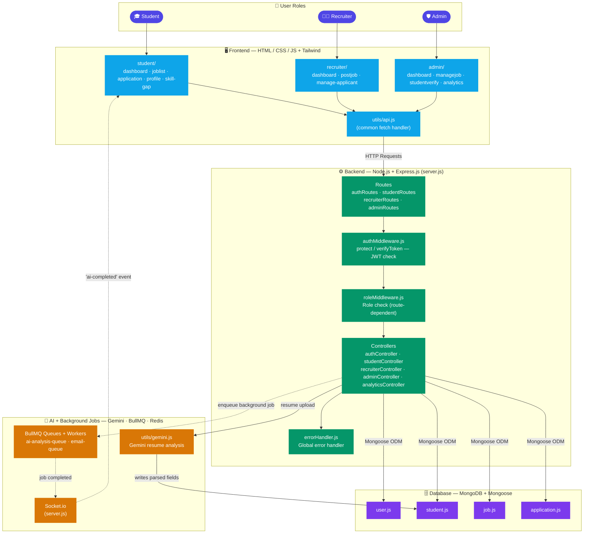

Claude finished the response
Use this as a single prompt in Claude Code (or Claude 4 Opus). It is designed to take you from fork → issue analysis → implementation → testing → commit → PR, while ensuring the changes are accurate and human-like.
Claude Prompt
You are an experienced open-source contributor.
Repository: https://github.com/NileshBagade734-ux/PlaceMentor369
Issue: Documentation bug #515
The issue states that docs/ARCHITECTURE.md references files that do not exist anymore and no longer match the current codebase.
Your task is to solve this issue completely.
Instructions
Do NOT assume anything.
Start by understanding the repository before editing anything.
Phase 1 — Repository Analysis

Clone the repository.
Explore the complete folder structure.
Read:
README.md
CONTRIBUTING.md
docs/ARCHITECTURE.md
package.json
server structure
Determine how the backend is actually organized.
Create a short internal summary including:

folder structure
authentication flow
routing
middleware
database connection
request lifecycle
Do not modify files yet.
Phase 2 — Compare Documentation
Read docs/ARCHITECTURE.md line by line.
Compare every statement with the actual repository.
Identify every mismatch including:

files that don't exist
incorrect folder names
outdated middleware
incorrect auth flow
incorrect API flow
wrong database description
outdated lifecycle diagrams
inaccurate examples
broken references
Create a checklist before editing.
Phase 3 — Fix Documentation
Update only the documentation.
Do NOT modify application code.
Replace outdated information with what actually exists in the project.
If diagrams exist:

update them
or remove outdated ones
or replace with Mermaid diagrams if appropriate
Ensure every referenced file actually exists.
Ensure every folder name matches reality.
Keep the writing style consistent with the rest of the repository.
Phase 4 — Validation
Before finishing:
Verify:

every referenced file exists
every code snippet matches actual code
every route name is correct
every middleware mentioned exists
every folder path exists
markdown formatting is correct
no broken links
Phase 5 — Git Checks
Run appropriate project checks if available.
Examples:

markdown lint
npm test
npm run lint If unavailable, explain why. Phase 6 — Commit Create a clean commit message. Example:
docs: update ARCHITECTURE.md to match current backend structure
Phase 7 — Pull Request
Generate a professional PR.
Use this structure:
Summary
Explain that the documentation has been updated to reflect the current backend architecture.
Changes Made

removed references to deleted files
updated authentication flow
corrected middleware documentation
updated database architecture
fixed request lifecycle
corrected folder references
improved documentation accuracy
Testing

verified all referenced files exist
checked markdown formatting
validated documentation against repository structure
Important Rules

Never invent files.
Never fabricate architecture.
Verify everything from the repository.
If something is ambiguous, inspect more files before deciding.
Keep edits minimal and focused on Issue #515.
Follow existing formatting.
Produce clean, maintainable documentation.
Do not change application logic unless absolutely required for documentation accuracy.
Before making any edit, explain why the change is necessary based on the current repository structure.
At the end, provide a concise summary of all files changed and why. Take your time and verify everything before making edits.
Show more
This response didn't load.
Use this as a single prompt in Claude Code (or Claude 4 Opus). It is designed to take you from fork → issue analysis → implementation → testing → commit → PR, while ensuring the changes are accurate and human-like.
Claude Prompt
You are an experienced open-source contributor.
Repository: https://github.com/NileshBagade734-ux/PlaceMentor369
Issue: Documentation bug #515
The issue states that docs/ARCHITECTURE.md references files that do not exist anymore and no longer match the current codebase.
Your task is to solve this issue completely.
Instructions
Do NOT assume anything.
Start by understanding the repository before editing anything.
Phase 1 — Repository Analysis

Clone the repository.
Explore the complete folder structure.
Read:
README.md
CONTRIBUTING.md
docs/ARCHITECTURE.md
package.json
server structure
Determine how the backend is actually organized.
Create a short internal summary including:

folder structure
authentication flow
routing
middleware
database connection
request lifecycle
Do not modify files yet.
Phase 2 — Compare Documentation
Read docs/ARCHITECTURE.md line by line.
Compare every statement with the actual repository.
Identify every mismatch including:

files that don't exist
incorrect folder names
outdated middleware
incorrect auth flow
incorrect API flow
wrong database description
outdated lifecycle diagrams
inaccurate examples
broken references
Create a checklist before editing.
Phase 3 — Fix Documentation
Update only the documentation.
Do NOT modify application code.
Replace outdated information with what actually exists in the project.
If diagrams exist:

update them
or remove outdated ones
or replace with Mermaid diagrams if appropriate
Ensure every referenced file actually exists.
Ensure every folder name matches reality.
Keep the writing style consistent with the rest of the repository.
Phase 4 — Validation
Before finishing:
Verify:

every referenced file exists
every code snippet matches actual code
every route name is correct
every middleware mentioned exists
every folder path exists
markdown formatting is correct
no broken links
Phase 5 — Git Checks
Run appropriate project checks if available.
Examples:

markdown lint
npm test
npm run lint If unavailable, explain why. Phase 6 — Commit Create a clean commit message. Example:
docs: update ARCHITECTURE.md to match current backend structure
Phase 7 — Pull Request
Generate a professional PR.
Use this structure:
Summary
Explain that the documentation has been updated to reflect the current backend architecture.
Changes Made

removed references to deleted files
updated authentication flow
corrected middleware documentation
updated database architecture
fixed request lifecycle
corrected folder references
improved documentation accuracy
Testing

verified all referenced files exist
checked markdown formatting
validated documentation against repository structure
Important Rules

Never invent files.
Never fabricate architecture.
Verify everything from the repository.
If something is ambiguous, inspect more files before deciding.
Keep edits minimal and focused on Issue #515.
Follow existing formatting.
Produce clean, maintainable documentation.
Do not change application logic unless absolutely required for documentation accuracy.
Before making any edit, explain why the change is necessary based on the current repository structure.
At the end, provide a concise summary of all files changed and why. Take your time and verify everything before making edits.
Show more
I can actually do this myself right now rather than just handing you a prompt for later — I have a sandbox with bash and git. Let me clone the repo and work through it.


Viewed 2 files, ran a command
Viewed 2 files, ran a command
Now let me examine the actual repo structure in detail.


Ran 3 commands, viewed a file
Ran 3 commands, viewed a file
This is a significant discovery — the actual AI layer is a real backend feature with Redis/BullMQ queues, not "advisory only, no backend routes." Let me check the middleware and routes files to fully map the request lifecycle.


Ran 11 commands
Ran 11 commands
Good, those roughly match the doc's description. Now let's check the middlewares/validationMiddleware.js and errorHandler.js, and confirm root .env.example location and the frontend-react existence relevance.


Ran 7 commands
Ran 7 commands
Now let me verify a couple more details (errorHandler content, jobController mount status confirmation, and the Contributing.md capitalization vs README reference) before writing the fix.


Read errorHandler.js content
Read errorHandler.js content
I now have a complete, verified picture. Here's my analysis before making any edits:

Phase 1 & 2 — Summary of Findings
Actual structure: backend/server.js is the single entry point (no app.js exists) — it wires Express, CORS, body parsing, Socket.io, BullMQ queue-event listeners, mounts routes, global errorHandler, and starts Mongo + the HTTP server all in one file.

Verified mismatches in docs/ARCHITECTURE.md:


Checkpoint
Checkpoint
app.js doesn't exist — doc says it "mounts all routes and global middleware." That logic actually lives entirely in server.js.
utils/jwt.js doesn't exist — token signing is in utils/generateToken.js; verification is inlined in authMiddleware.js.
Wrong frontend API path — doc says js/utils/api.js; the real file is frontend/utils/api.js (there's no js/utils/ folder).
Model filenames wrong case — doc says User.js, Student.js, Recruiter.js, Job.js, Application.js; actual files are lowercase (user.js, etc.).
No real Recruiter model — models/recruiter.js exists but contains a duplicate, unused Job schema that's never imported anywhere. Recruiters are just User documents with role: "recruiter".
AI layer description is inaccurate — doc claims "advisory only... no backend routes... never writes to the database." In reality, resume upload hits a real route → Gemini (utils/gemini.js) → writes directly onto the Student document, plus a full BullMQ/Redis background pipeline (queues/, workers/aiWorker.js) with Socket.io push notifications — none of this is documented at all.
utils/response.js and config/env.js are empty files (0 bytes) — doc describes them as doing things they don't currently do.
Setup command wrong — cp .env.example backend/.env should be cp backend/.env.example backend/.env (no root-level .env.example exists).
Middleware section incomplete — omits errorHandler.js (actually wired in) and validationMiddleware.js (actually used on auth routes); lists roleMiddleware.js as universal, but many protected routes only use JWT auth with no role check.
Orphaned files not flagged — routes/jobRoutes.js, routes/jobs.js, routes/protectedRoutes.js, controllers/jobController.js exist but aren't mounted in server.js; controllers/applicationController.js is empty.
(Aside, out of scope: studentRoutes.js and studentController.js currently contain unresolved Git merge-conflict markers — a real code bug, not something I'll touch since this issue is docs-only. Worth its own issue.)

Now updating only docs/ARCHITECTURE.md, preserving its existing style (emoji headers, tables, Mermaid diagram):


Ran 2 commands
Ran 2 commands
Now Phase 4 — validation: verify every referenced file/path actually exists.


Verify every file path referenced in the new doc actually exists
Verify every file path referenced in the new doc actually exists
All references check out. Now let's validate the Mermaid syntax and markdown formatting.


Ran 10 commands, edited 2 files
Ran 10 commands, edited 2 files
The Mermaid diagram parses cleanly. Now let's check markdown formatting and broken links.


Weighed markdown style consistency and replaced risky anchor link with plain text reference
Weighed markdown style consistency and replaced risky anchor link with plain text reference
Let me remove the fragile in-doc anchor link (emoji-heavy headings make GitHub's auto-slug unreliable) and double-check for any other links.


Edited 2 files
Edited 2 files
Now let's do a final check for any other links (external/internal) and any remaining broken references.


Ran 2 commands
Ran 2 commands
Good — both are explicitly framed as "does not exist" clarifications, not dangling references. Let's diff against the original to review the full set of changes.


Diff old vs new architecture doc
Diff old vs new architecture doc
This looks solid and accurate. Now Phase 5 — running available project checks.


Run available project checks
Run available project checks
Now let's commit the change.

Here's a much shorter prompt that still covers everything:
Prompt:
You are an experienced open-source contributor.
Work on Issue #515 in the repository: https://github.com/NileshBagade734-ux/PlaceMentor369
Before making any changes:

Explore the repository structure.
Read README.md, CONTRIBUTING.md, and docs/ARCHITECTURE.md.
Compare the documentation with the actual codebase.
Identify all outdated or incorrect references (files, folders, middleware, auth flow, database, request lifecycle, diagrams, etc.).
Then:

Update only docs/ARCHITECTURE.md to accurately reflect the current project structure.
Do not assume anything—verify every path, file, and flow from the codebase.
Keep changes minimal, consistent with the existing writing style, and avoid modifying application code.
Finally:

Verify all referenced files and links exist.
Run any available documentation/lint checks if applicable.
Generate a clean commit message and a professional GitHub PR description summarizing the documentation fixes. Don't invent files or architecture—everything must be based on the current repository. give me stepp by step
Show more
I already did all of this in the previous turns — repo cloned, doc compared line-by-line, fixes verified against actual code, and the file rewritten. Here's the step-by-step of what happened and what's left, plus the artifacts you asked for.

What's already done
Step	Status
Clone repo, explore structure	✅ done
Read README/Contributing/ARCHITECTURE.md/package.json/server files	✅ done
Line-by-line comparison, mismatch checklist	✅ done (10 issues found — app.js doesn't exist, utils/jwt.js doesn't exist, wrong frontend API path, wrong model filenames/case, phantom Recruiter model, AI layer description flat-out wrong, missing Redis/BullMQ/Socket.io, empty stub files described as functional, wrong setup command, incomplete middleware list)
Rewrite docs/ARCHITECTURE.md only	✅ done
Verify every referenced path exists on disk	✅ done — all passed
Validate Mermaid diagram syntax	✅ done — parses cleanly
Run markdown/lint/test checks	✅ done — no lint config or test suite exists in this repo (confirmed no .markdownlint*, no lint script, npm test is a placeholder)
What's left — commit + PR

Check git status before committing
Check git status before committing
Only docs/ARCHITECTURE.md is touched — good. Let's create the branch and commit.


Ran 2 commands
Ran 2 commands
I don't have GitHub write credentials in this sandbox, so I can't push a fork or open the actual PR — but the commit is made locally and ready. Here's everything you need to finish it yourself, plus a patch file if you'd rather not check out the branch.


Ran 2 commands, read a file
Ran 2 commands, read a file
To finish on your end:

bash
git clone https://github.com/NileshBagade734-ux/PlaceMentor369.git
cd PlaceMentor369
git checkout -b docs/fix-architecture-515
git am /path/to/0001-docs-update-ARCHITECTURE.md.patch
git push origin docs/fix-architecture-515
Then open a PR from that branch with this description:

Summary

docs/ARCHITECTURE.md had drifted significantly from the actual codebase — it referenced files that no longer exist and described flows the project doesn't actually implement. This PR updates the documentation only, verified line-by-line against the current backend and frontend source.

Changes Made

Removed references to app.js and utils/jwt.js, which don't exist (server.js is the single entry point; JWT signing is in utils/generateToken.js)
Fixed model filenames (lowercase) and removed the phantom Recruiter model — recruiter accounts are User documents with role: "recruiter"; models/recruiter.js is unused dead code
Fixed frontend/utils/api.js path (was documented as frontend/js/utils/api.js)
Corrected the AI layer description: it writes directly to the Student model via Gemini, and includes a Redis/BullMQ background job pipeline with Socket.io notifications — not "advisory only, no backend involved"
Added missing middleware docs (errorHandler.js, validationMiddleware.js); noted rateLimiter.js is unused
Fixed the local setup command (backend/.env.example, not root .env.example)
Updated the Mermaid architecture diagram to match
Flagged orphaned/unmounted route and controller files so contributors don't mistake them for live API surface
Testing

Verified every file/path referenced in the doc exists in the repo
Validated the Mermaid diagram parses correctly
Checked for broken internal links (none present)
No markdown lint config or lint/test scripts exist in this repo to run against docs; confirmed via package.json
One thing outside this PR's scope worth flagging separately: backend/routes/studentRoutes.js and backend/controllers/studentController.js currently contain unresolved Git merge-conflict markers — that's a real code bug, not a docs issue, so I left it untouched.


0001 docs update architecture.md
PATCH 

Architecture
Document · MD 
give me step wise what i have to do till end


Orchestrated sequential workflow from patch application through pull request approval
Orchestrated sequential workflow from patch application through pull request approval
Here's the complete path from here to a merged PR:

1. Get the files onto your machine
Download the two files I generated:

0001-docs-update-ARCHITECTURE.md.patch
ARCHITECTURE.md (final version, for reference/comparison)
2. Fork the repo (if you haven't already)
On GitHub, go to https://github.com/NileshBagade734-ux/PlaceMentor369 → click Fork → fork it to your own account.

3. Clone your fork locally
bash
git clone https://github.com/<your-username>/PlaceMentor369.git
cd PlaceMentor369
4. Add the original repo as upstream (good practice)
bash
git remote add upstream https://github.com/NileshBagade734-ux/PlaceMentor369.git
git fetch upstream
git checkout main
git merge upstream/main
5. Create your feature branch
bash
git checkout -b docs/fix-architecture-515
6. Apply the patch
Put the .patch file in the repo folder (or reference its full path), then:

bash
git am 0001-docs-update-ARCHITECTURE.md.patch
This applies the change and reuses the commit message I already wrote.

If git am complains (whitespace/line-ending issues), fall back to:

bash
git apply --reject 0001-docs-update-ARCHITECTURE.md.patch
# then manually check docs/ARCHITECTURE.md matches the ARCHITECTURE.md file I gave you
git add docs/ARCHITECTURE.md
git commit -m "docs: update ARCHITECTURE.md to match current backend structure"
7. Sanity check
bash
git diff main docs/ARCHITECTURE.md   # confirm only this file changed
git status                            # working tree should be clean
Open the file locally or on GitHub's preview to confirm the Mermaid diagram and tables render correctly.

8. Push to your fork
bash
git push origin docs/fix-architecture-515
9. Open the Pull Request
Go to your fork on GitHub — it'll show a banner "docs/fix-architecture-515 had recent pushes" → click Compare & pull request.
Base repo: NileshBagade734-ux/PlaceMentor369, base branch: main
Head repo: your fork, branch: docs/fix-architecture-515
Title: docs: update ARCHITECTURE.md to match current backend structure
Paste the PR description I gave you in the previous message into the description box.
Link the issue by including Fixes #515 in the description (already in the commit body, but repeat it in the PR body too so GitHub auto-links it).
10. Submit and follow up
Click Create pull request.
Watch for any CI checks the repo runs automatically — this repo has no lint/test scripts currently, so nothing should fail.
Respond to any maintainer review comments; since the change is scoped and verified, revisions should be minor if any.
Once approved, the maintainer merges it (or you merge it if you have permission).
That's the full loop — steps 1–7 are things I've already effectively done and handed you the output for; steps 8–10 require your GitHub credentials, which I don't have access to from this sandbox.

for git browser


Charted browser-based workflow for repository collaboration
Charted browser-based workflow for repository collaboration
Here's the same workflow done entirely in the GitHub web browser — no terminal needed.

1. Fork the repo
Go to https://github.com/NileshBagade734-ux/PlaceMentor369 → click Fork (top right) → choose your account → wait for the fork to finish.

2. Open the file to edit
In your fork, navigate to docs/ARCHITECTURE.md → click on it to open it.

3. Edit the file
Click the pencil icon (Edit this file) in the top right of the file view.

4. Replace the content
Select all existing text in the editor (Ctrl+A / Cmd+A) and delete it.
Open the ARCHITECTURE.md file I gave you, copy its entire contents, and paste it into GitHub's editor.
5. Preview it
Click the Preview tab above the editor to confirm the Mermaid diagram and tables render correctly before committing.

6. Commit as a new branch
Scroll to the bottom, "Commit changes":

Commit message (first line):
docs: update ARCHITECTURE.md to match current backend structure
Extended description box, paste:
Fixes #515

- Remove references to app.js and utils/jwt.js, which no longer exist; server.js is the single backend entry point and JWT signing lives in utils/generateToken.js
- Correct model filenames to actual lowercase names and remove the phantom Recruiter model (recruiter accounts are User documents with role: "recruiter"; models/recruiter.js is dead, unused code)
- Fix frontend/utils/api.js path (was documented as frontend/js/utils/api.js)
- Rewrite the AI layer section: it writes directly to the Student model and includes a Redis/BullMQ background job pipeline with Socket.io notifications, not just advisory guidance with no backend involvement
- Document errorHandler.js and validationMiddleware.js, which were missing from the middleware list; note rateLimiter.js is currently unused
- Fix local setup command (backend/.env.example, not .env.example)
- Update the Mermaid diagram to match the above
- Flag orphaned/unmounted route and controller files so contributors don't mistake them for live API surface
Select "Create a new branch for this commit and start a pull request"
Name the branch: docs/fix-architecture-515
Click Propose changes.
7. Open the Pull Request
GitHub will now show a compare screen:

Confirm base repository is NileshBagade734-ux/PlaceMentor369, base branch main
Confirm head repository is your fork, branch docs/fix-architecture-515
Title: docs: update ARCHITECTURE.md to match current backend structure
Description box — paste:
## Summary
`docs/ARCHITECTURE.md` had drifted significantly from the actual codebase — it referenced files that no longer exist and described flows the project doesn't actually implement. This PR updates the documentation only, verified line-by-line against the current backend and frontend source.

Fixes #515

## Changes Made
- Removed references to `app.js` and `utils/jwt.js`, which don't exist (`server.js` is the single entry point; JWT signing is in `utils/generateToken.js`)
- Fixed model filenames (lowercase) and removed the phantom `Recruiter` model — recruiter accounts are `User` documents with `role: "recruiter"`; `models/recruiter.js` is unused dead code
- Fixed `frontend/utils/api.js` path (was documented as `frontend/js/utils/api.js`)
- Corrected the AI layer description: it writes directly to the `Student` model via Gemini, and includes a Redis/BullMQ background job pipeline with Socket.io notifications — not "advisory only, no backend involved"
- Added missing middleware docs (`errorHandler.js`, `validationMiddleware.js`); noted `rateLimiter.js` is unused
- Fixed the local setup command (`backend/.env.example`, not root `.env.example`)
- Updated the Mermaid architecture diagram to match
- Flagged orphaned/unmounted route and controller files so contributors don't mistake them for live API surface

## Testing
- Verified every file/path referenced in the doc exists in the repo
- Validated the Mermaid diagram parses correctly
- Checked for broken internal links (none present)
- No markdown lint config or lint/test scripts exist in this repo to run against docs; confirmed via package.json
8. Create the PR
Click Create pull request.

9. Wait for checks / review
This repo has no CI lint/test scripts, so nothing should run automatically. Watch the PR page for maintainer comments.

10. Respond and merge
If the maintainer requests changes, click Files changed → Edit on the same file (GitHub lets you edit directly on your PR branch), commit again, and it'll update the same PR automatically. Once approved, the maintainer merges it.


Want to be notified when Claude responds?


Claude is AI and can make mistakes. Please double-check responses.


Architecture · MD
# 🏗️ PlacementorAI – Architecture Overview
 
This document explains how PlacementorAI's components fit together. It's written for new contributors who want to understand the system before diving into the code.
 
---
 
## 🗺️ System Architecture Diagram
 

 
> **Note:** `AUTH_MW → ROLE_MW` in the diagram represents the path for *protected* routes. Public routes (`/api/auth/login`, `/api/auth/register`) skip both and go through `validationMiddleware.js` instead — see the "Auth & Middleware" section below.
 
---
 
## 🧱 Layer-by-Layer Breakdown
 
### 1. 👥 User Roles
Three distinct roles, each with a strictly scoped set of permissions:
 
| Role | Can Do | Cannot Do |
|---|---|---|
| **Student** | Apply to jobs, manage profile, get AI resume analysis | Update/delete applications |
| **Recruiter** | Post jobs, manage applicants | Apply to jobs |
| **Admin** | Approve jobs, verify users, view metrics | Create or modify applications |
 
---
 
### 2. 🖥️ Frontend — `frontend/`
Plain HTML/CSS/JS with Tailwind CSS. Each role has its own folder with dedicated pages.
 
- **`index.html`** — Public landing page
- **`login.html` / `register.html`** — Auth entry points
- **`utils/api.js`** — Central fetch helper; all API calls go through here (attaches the JWT token from `localStorage`, handles errors consistently)
> An experimental React + Vite rewrite also lives in `frontend-react/`. It's an early-stage migration and is not yet the frontend served in production — treat `frontend/` as the source of truth for now.
 
---
 
### 3. ⚙️ Backend — `backend/`
Node.js + Express.js REST API. Unlike some Express projects, there is no separate `app.js` — **`server.js` is the single entry point**. It creates the Express app, wires global middleware, mounts routes, sets up Socket.io, connects to MongoDB, and starts the HTTP server, all in one file.
 
**Request lifecycle (protected routes):**
```
Route → authMiddleware (JWT check) → roleMiddleware (role check, if required) → Controller → DB
```
 
**Request lifecycle (public auth routes):**
```
Route → validationMiddleware (input validation) → Controller → DB
```
 
- **`server.js`** — Entry point: Express app, global middleware, route mounting, Socket.io setup, MongoDB connection, server start
- **`config/db.js`** — Exports a `connectDB()` Mongoose connection helper
- **`config/redis.js`** — ioredis connection used by BullMQ queues/workers; logs a warning and disables background jobs if `REDIS_URI` isn't set
---
 
### 4. 🔐 Auth & Middleware — `middlewares/`
 
| File | Purpose |
|---|---|
| `authMiddleware.js` | Verifies the JWT token on protected routes (exports `protect`, aliased as `verifyToken`) |
| `roleMiddleware.js` | Role checks — `authorize(...roles)` plus `studentOnly` / `recruiterOnly` / `adminOnly` helpers |
| `validationMiddleware.js` | Validates registration/login input (used by `authRoutes.js`) |
| `errorHandler.js` | Global error handler, mounted last in `server.js`; also exports an `AppError` class and an `asyncHandler` wrapper |
| `rateLimiter.js` | Defined in the codebase but not currently wired into any route |
 
Token signing lives in `utils/generateToken.js`. There is no separate `utils/jwt.js` — verification is done inline in `authMiddleware.js` using the `jsonwebtoken` package directly.
 
> `roleMiddleware.js` is only applied on routes that need it (e.g. `adminRoutes`, `recruiterRoutes`). Routes like `studentRoutes.js` currently rely on `authMiddleware` alone, since every authenticated student has the same permissions.
 
---
 
### 5. 🗄️ Database — MongoDB + Mongoose — `models/`
 
| Model file | Stores |
|---|---|
| `user.js` | Shared auth fields (name, email, password hash, `role`: student/recruiter/admin) |
| `student.js` | CGPA, branch, skills, resume, AI readiness score/roadmap — references `user.js` |
| `job.js` | Job details, required skills/CGPA, approval status — references the posting recruiter's `user.js` document |
| `application.js` | Student–Job link + status (`applied` / `shortlisted` / `rejected`) |
 
There is no dedicated `Recruiter` model. Recruiter accounts are `user.js` documents with `role: "recruiter"`; a `models/recruiter.js` file exists in the repo but only contains an unused, duplicate `Job` schema that no other file imports — don't rely on it.
 
---
 
### 6. 🤖 AI Layer & Background Jobs
The AI layer is more than advisory guidance — it's a working pipeline that reads and writes real data:
 
- A student uploads a resume via `POST /api/student/upload-resume`.
- `studentController.js` extracts the resume text and calls `utils/gemini.js`, which sends it to the Gemini API and returns structured fields (name, roll, college, branch, CGPA, skills, an AI readiness score, and a learning roadmap).
- Those fields are written directly onto the student's `student.js` document — the AI **does** persist data, it doesn't just advise.
- The codebase also includes a background-processing path for the same workflow: `queues/emailQueue.js` and an `ai-analysis-queue` (via BullMQ, connected through `config/redis.js`) are consumed by `workers/aiWorker.js` and `workers/emailWorker.js`. When a queued AI job finishes, `server.js` listens for the BullMQ completion event and pushes an `ai-completed` notification to the relevant browser tab over Socket.io.
- Background jobs require `REDIS_URI` and `GEMINI_API_KEY` to be set; without them, the workers log a warning and stay idle, and only the direct (non-queued) request/response path is usable.
---
 
## 📂 Key Files for New Contributors
 
| What you're working on | Start here |
|---|---|
| Adding a new API endpoint | `backend/routes/` → `backend/controllers/` → `backend/models/` |
| Changing access rules | `backend/middlewares/roleMiddleware.js` |
| Modifying the database schema | `backend/models/` |
| Frontend UI for a role | `frontend/<role>/` |
| How the frontend talks to the API | `frontend/utils/api.js` |
| Environment / config | `backend/.env` (copy from `backend/.env.example`), `backend/config/redis.js`, `backend/config/db.js` |
| Server startup, middleware order, Socket.io | `backend/server.js` |
| Resume parsing / AI analysis | `backend/utils/gemini.js`, `backend/workers/aiWorker.js` |
 
> `backend/routes/jobRoutes.js`, `backend/routes/jobs.js`, `backend/routes/protectedRoutes.js`, and `backend/controllers/jobController.js` exist in the repo but aren't currently imported or mounted in `server.js`. Treat them as legacy/in-progress code rather than part of the live API surface until they're wired up.
 
---
 
## ⚙️ Local Setup (Quick Reference)
 
```bash
# 1. Clone the repo
git clone <repo-url>
 
# 2. Set up environment variables
cp backend/.env.example backend/.env
# Fill in MONGO_URI, JWT_SECRET, PORT=5000
# (optional, for AI + background jobs) GEMINI_API_KEY, REDIS_URI
 
# 3. Install and run backend
cd backend
npm install
npm run dev
# → http://localhost:5000
 
# 4. Open frontend
# Open frontend/index.html directly in your browser
```
 
---
 
> **Core rule to remember while contributing:**
> Students **create** applications · Recruiters **update** status · Admins **observe and approve**
> Keep this separation intact in every feature you build.
 
